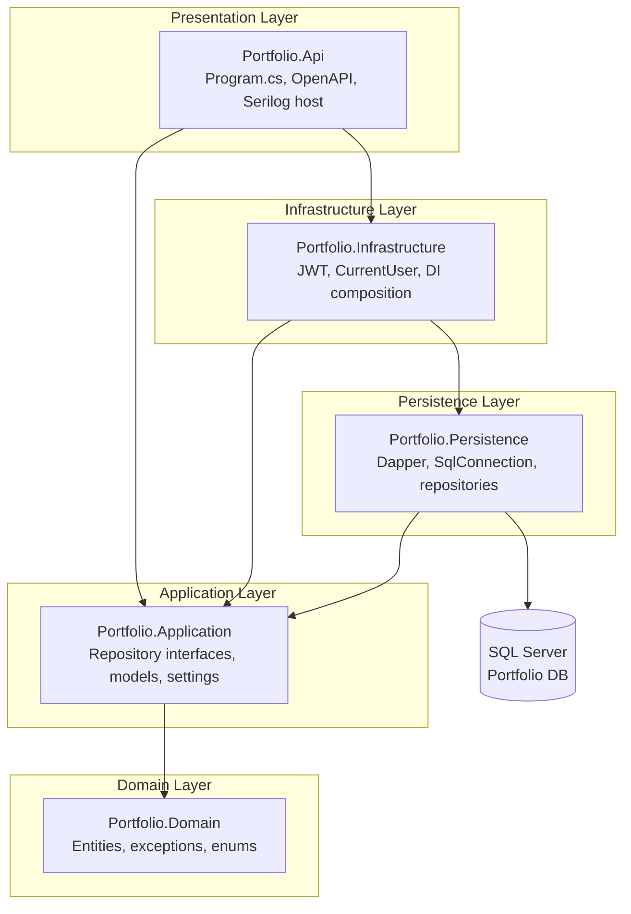
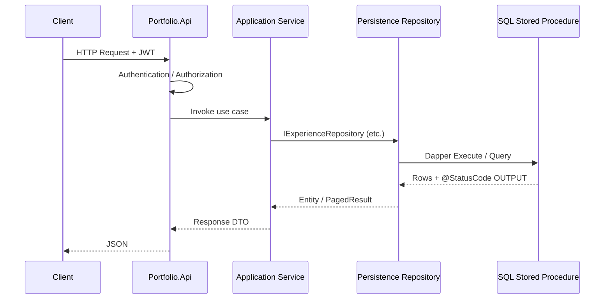

# Portfolio Platform — Clean Architecture

ASP.NET Core 9 solution aligned with the existing SQL Server `Portfolio` database and Dapper stored-procedure layer.

## Solution layout

```
Portfolio/
├── Portfolio.sln
├── ARCHITECTURE.md
└── src/
    ├── Portfolio.Api/                 # Presentation (HTTP host)
    ├── Portfolio.Application/         # Use cases, contracts, DTOs
    ├── Portfolio.Domain/              # Entities, enums, domain rules
    ├── Portfolio.Infrastructure/      # JWT, Serilog host wiring, cross-cutting
    └── Portfolio.Persistence/         # Dapper + SQL Server repositories
```

## Project references (dependency rule)

```
Portfolio.Api
    ├── Portfolio.Application
    └── Portfolio.Infrastructure

Portfolio.Infrastructure
    ├── Portfolio.Application
    └── Portfolio.Persistence

Portfolio.Persistence
    └── Portfolio.Application

Portfolio.Application
    └── Portfolio.Domain

Portfolio.Domain
    └── (none)
```

**Rule:** dependencies point inward only. `Domain` has zero project references.

## Dependency flow



## Request flow (future controllers)



## Folder structure by project

### Portfolio.Domain
```
Common/           AuditableEntity, ISoftDeletable
Entities/         Experience, Projects, Education, Skills, Awards, Certifications, Documents
Enums/            SpStatusCode
Exceptions/       DomainException, NotFoundException
```

### Portfolio.Application
```
Abstractions/
  Identity/       IJwtTokenService
  Persistence/    I*Repository, IDbConnectionFactory
Common/
  Interfaces/     ICurrentUserService, IDateTimeProvider
  Models/         PagedResult, SpExecutionResult, PaginationRequest
  Settings/       DatabaseSettings
Features/         (per-module use cases — add next)
DependencyInjection.cs
```

### Portfolio.Persistence
```
Connection/       SqlConnectionFactory
Common/           StoredProcedureExecutor
Repositories/     Experience, Projects, Education, Skills, Awards, Certifications, Documents
DependencyInjection.cs
```

### Portfolio.Infrastructure
```
Authentication/   JwtSettings, JwtTokenService
Services/         CurrentUserService, DateTimeProvider
DependencyInjection.cs
```

### Portfolio.Api
```
Extensions/       SerilogExtensions
Program.cs
appsettings.json
Controllers/      (add later — not scaffolded)
```

## Technology mapping

| Concern | Implementation |
|---------|----------------|
| Runtime | ASP.NET Core 9 |
| Data access | Dapper → existing `usp_*` stored procedures |
| Database | SQL Server (`Portfolio`) |
| Auth | JWT Bearer (`Microsoft.AspNetCore.Authentication.JwtBearer`) |
| Logging | Serilog (Console + rolling file) |
| DI | Built-in `IServiceCollection` extension methods |

## Deployment order (database already exists)

1. Run `Database/00_Deploy_All.sql` if schema/SPs are not applied.
2. Update `appsettings.json` → `Database:ConnectionString`.
3. Replace `Jwt:SecretKey` with a secure value (User Secrets in dev).
4. `dotnet build` then `dotnet run --project src/Portfolio.Api`.

## Next steps

1. Add `Features/{Module}/` commands & queries in Application.
2. Implement Dapper calls in Persistence repositories.
3. Add API controllers (thin — delegate to Application only).
4. Add global exception middleware and `ProblemDetails` mapping for `SpStatusCode`.
